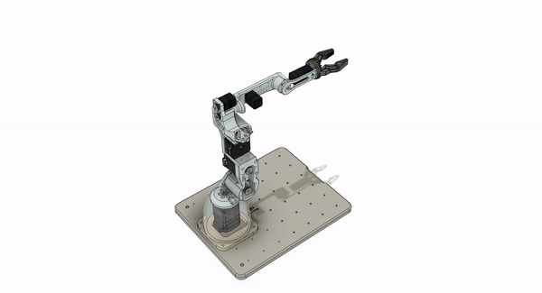

# SILCA: Simple Intelligent Low Cost Robot Arm 

### SILCA 3D Model
   

The 3D model was donde in fusion 360 and it's avilable in 2.Hardware/1.CAD_Model/

### TODO
  - Finish SW development with CAN protocol and UART protocol
  - Finish firmware 
  - Finish REF design base board (i.e., the controller circuit board inside the mechanical arm base)

### Goal 
 Create an intelligent, low-cost arm that every student can afford
  - Everything has to be 3D printer
  - Aim for a price less than ~ 300 USD

